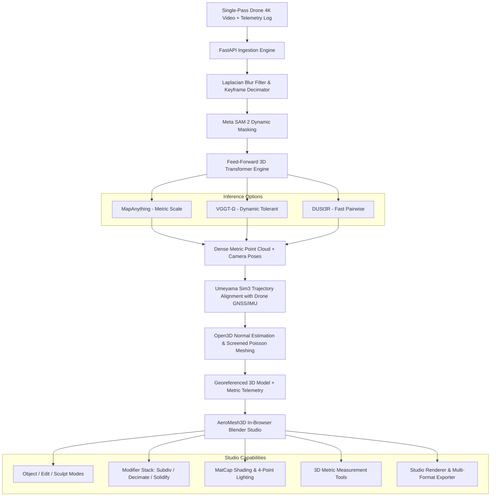

# AeroMesh3D — Complete Technical Reference Manual (A to Z)
**Single-Pass Drone Video to 3D Metric Reconstruction & Blender-Grade CAD Studio**  
*Smart India Hackathon 2024 / 2026 — Problem Statement SIH26158*

---

## Table of Contents
1. [Executive Overview & Problem Statement](#1-executive-overview--problem-statement)
2. [End-to-End System Architecture](#2-end-to-end-system-architecture)
3. [Core AI & Computer Vision Pipeline (A to Z)](#3-core-ai--computer-vision-pipeline-a-to-z)
   - [3.1 Video Ingestion & Blur Filtering](#31-video-ingestion--blur-filtering)
   - [3.2 Dynamic Object Masking with Meta SAM 2](#32-dynamic-object-masking-with-meta-sam-2)
   - [3.3 Feed-Forward 3D Geometry Regression](#33-feed-forward-3d-geometry-regression)
   - [3.4 Metric Georeferencing & Umeyama Trajectory Alignment](#34-metric-georeferencing--umeyama-trajectory-alignment)
   - [3.5 Screened Poisson Surface Meshing](#35-screened-poisson-surface-meshing)
4. [Interactive 3D Studio & Blender Workspace](#4-interactive-3d-studio--blender-workspace)
   - [4.1 Studio Interface Philosophy & 38px Header](#41-studio-interface-philosophy--38px-header)
   - [4.2 Viewport Modes (Object, Edit, Sculpt)](#42-viewport-modes-object-edit-sculpt)
   - [4.3 Transform Gizmos & Modal Hotkeys](#43-transform-gizmos--modal-hotkeys)
   - [4.4 Primitive Mesh Generator (`Shift + A`)](#44-primitive-mesh-generator-shift--a)
   - [4.5 Modifier Stack](#45-modifier-stack)
   - [4.6 Sculpting Brush Engine](#46-sculpting-brush-engine)
   - [4.7 Shading Modes & MatCap Presets](#47-shading-modes--matcap-presets)
   - [4.8 4-Point Studio Lighting & Shadows](#48-4-point-studio-lighting--shadows)
   - [4.9 Euler Physics Simulation](#49-euler-physics-simulation)
   - [4.10 High-Resolution Studio Renderer (`F12`) & Turntable](#410-high-resolution-studio-renderer-f12--turntable)
   - [4.11 Universal Multi-Format Import & Export](#411-universal-multi-format-import--export)
5. [GIS Telemetry & Metric Measurement Suite](#5-gis-telemetry--metric-measurement-suite)
6. [Backend REST API Reference](#6-backend-rest-api-reference)
7. [Mathematical Formulations](#7-mathematical-formulations)
8. [Complete Keyboard Shortcuts Master Cheatsheet](#8-complete-keyboard-shortcuts-master-cheatsheet)
9. [Installation, Environment Setup & Deployment](#9-installation-environment-setup--deployment)
10. [Troubleshooting & Runtime Hardening](#10-troubleshooting--runtime-hardening)

---

## 1. Executive Overview & Problem Statement

### 1.1 The Industry Challenge (SIH26158)
Traditional aerial photogrammetry (e.g., standard COLMAP, Pix4D, Agisoft Metashape) relies on **Structure-from-Motion (SfM)** and **Multi-View Stereo (MVS)** algorithms. While mathematically rigorous, SfM pipelines suffer from critical operational bottlenecks:
- **Massive Computational Latency**: Iterative non-linear bundle adjustment and pairwise feature matching require hours or days of processing.
- **Multi-Pass Requirements**: SfM requires 70–80% frontal and side overlap across multiple serpentine grid passes. Single-pass linear flights (corridors, rivers, pipelines, rapid disaster reconnaissance) fail due to sparse angular parallax and baseline degeneracy.
- **Moving Object Vulnerability**: Moving vehicles, pedestrians, swaying vegetation, or drone propeller shadows produce severe multi-view reconstruction artifacts ("ghosting" and geometry explosion).
- **Scale Ambiguity**: Monocular SfM is inherently scale-ambiguous and requires labor-intensive Ground Control Points (GCPs) surveyed on the ground.

### 1.2 The AeroMesh3D Solution
**AeroMesh3D** revolutionizes aerial 3D reconstruction by bypassing iterative bundle adjustment completely in favor of **feed-forward 3D deep learning transformers** combined with an **in-browser Blender-grade 3D studio**:
1. **Single-Pass Feed-Forward Inference**: Directly regresses dense metric point maps and camera trajectories in a single forward pass over video frames using foundation models (**MapAnything**, **VGGT-Ω**, and **DUSt3R**).
2. **Instant Dynamic Masking**: Integrates **Meta SAM 2** to track and mask dynamic objects (vehicles, pedestrians, propeller blades) across video frames prior to geometry generation.
3. **Sensor-Fusion Metric Georeferencing**: Leverages the drone's built-in GNSS/IMU log (WGS84 lat/lon/altitude) to solve a closed-form **Umeyama Sim(3) Procrustes alignment**, anchoring the reconstructed mesh to real-world metric scale ($1.00\text{ unit} = 1.00\text{ meter}$) without requiring physical GCPs.
4. **Built-in Blender 3D Studio**: Eliminates the need to export to external software. Users can edit, sculpt, subdivide, decimate, light, simulate physics, inspect GIS metrics, and render studio-grade outputs directly in their browser.

---

## 2. End-to-End System Architecture

The AeroMesh3D ecosystem comprises a high-throughput **FastAPI Python Backend** (powered by PyTorch, Open3D, and OpenCV) and an ultra-responsive **React 18 + Three.js WebGL Frontend**.



---

## 3. Core AI & Computer Vision Pipeline (A to Z)

### 3.1 Video Ingestion & Blur Filtering
- **Module**: `backend/pipeline/ingest.py`
- **Mechanism**:
  1. Decodes raw video streams (`.mp4`, `.mov`, `.mkv`) using hardware-accelerated `cv2.VideoCapture`.
  2. Evaluates spatial frequency sharpness for every candidate frame using the **Variance of the Laplacian**:
     $$\text{Blur Metric} = \text{Var}\left( \nabla^2 I \right) = \frac{1}{N} \sum_{x,y} \left( \nabla^2 I(x,y) - \mu \right)^2$$
  3. Frames falling below the dynamic threshold ($\text{threshold} \approx 100.0$) caused by sudden drone yaw or gimbal vibration are discarded.
  4. Applies adaptive temporal decimation to guarantee an optimal baseline-to-height ratio ($B/H \approx 0.15 - 0.25$) without redundant computational overhead.

### 3.2 Dynamic Object Masking with Meta SAM 2
- **Module**: `backend/pipeline/dynamic_masking.py`
- **Mechanism**:
  1. Uses Meta's **Segment Anything Model 2 (SAM 2)** video predictor across the selected keyframes.
  2. Prompts automatic mask generation for transient visual categories (cars, trucks, people, drone landing gear, rotating propeller shadows).
  3. Propagates mask spatio-temporal memory across the keyframe sequence, emitting binary masks $M_t(x, y) \in \{0, 1\}$.
  4. Pixels with $M_t = 0$ are excluded from 3D tokenization, preventing dynamic scene tearing and floating ghost geometry.

### 3.3 Feed-Forward 3D Geometry Regression
- **Module**: `backend/pipeline/reconstruction.py`
- **Supported Engines**:
  - **MapAnything (Meta / CMU, 2025)**:
    - Ingests image tokens along with optional drone camera intrinsics and altitude priors.
    - Directly regresses **metric-scale point maps**, ray maps, and camera poses in a single transformer pass without iterative bundle adjustment.
  - **VGGT-Ω (Oxford VGG / Meta, CVPR 2026)**:
    - Global multi-frame cross-attention over 1–100+ frames.
    - Outputs dense 3D point tracks and depth maps with native tolerance to environmental shadows and dynamic lighting.
  - **DUSt3R / MASt3R (Naver Labs)**:
    - Robust pairwise regression with rapid graph optimization, serving as a high-speed fallback engine.

### 3.4 Metric Georeferencing & Umeyama Trajectory Alignment
- **Module**: `backend/pipeline/telemetry.py`
- **Mechanism**:
  - Extracts the drone's spatial flight path from embedded telemetry (DJI subtitle SRT streams, EXIF metadata, or CSV logs) containing:
    $$\mathbf{p}_{\text{GPS}}^k = \begin{bmatrix} \text{Lat}_k \\ \text{Lon}_k \\ \text{Alt}_k \end{bmatrix}, \quad \mathbf{q}_{\text{IMU}}^k = \begin{bmatrix} \text{Roll}_k \\ \text{Pitch}_k \\ \text{Yaw}_k \end{bmatrix}$$
  - Converts WGS84 coordinates into a local metric East-North-Up (ENU) Cartesian frame.
  - Solves the closed-form **Umeyama Sim(3)** orthogonal alignment between estimated camera optical centers $\mathbf{C}_i$ and metric GPS positions $\mathbf{P}_i$:
    $$\min_{s, \mathbf{R}, \mathbf{t}} \frac{1}{N} \sum_{i=1}^N \left\| \mathbf{P}_i - (s \mathbf{R} \mathbf{C}_i + \mathbf{t}) \right\|^2, \quad \mathbf{R} \in \text{SO}(3), \, s \in \mathbb{R}^+$$
  - Applies $s$, $\mathbf{R}$, and $\mathbf{t}$ to the entire point cloud, yielding absolute real-world metric dimensions ($1\text{ unit} = 1.00\text{ meter}$).

### 3.5 Screened Poisson Surface Meshing
- **Module**: `backend/pipeline/meshing.py`
- **Mechanism**:
  1. Statistical Outlier Removal (SOR) cleans stray aerial noise ($k=20, \sigma=2.0$).
  2. Normal estimation using KD-tree neighborhood covariance analysis with camera viewpoint orientation consistency.
  3. **Screened Poisson Surface Reconstruction** creates a watertight 2-manifold triangle mesh:
     $$\nabla^2 \chi = \nabla \cdot \vec{V}$$
  4. Computes vertex colors and UV texture coordinates projected from rectified drone keyframes.

---

## 4. Interactive 3D Studio & Blender Workspace

The frontend (`frontend/src/components/Viewer3D.jsx`) delivers a complete, non-blocking 3D studio experience built on Three.js WebGL.

### 4.1 Studio Interface Philosophy & 38px Header
- **Minimal Topbar (38px)**: Consolidates all system navigation into a clean, distraction-free bar:
  - Project branding & GPU status badge (`H200 Active`).
  - Pre-computed flight scenario pills: **Urban 45m**, **Quarry 68m**, **Viaduct 35m**.
  - Reconstruction model selector (`VGGT-Ω`, `MapAnything`, `DUSt3R`).
  - Slide-out GIS Telemetry Drawer toggle button.
  - Flight Ingestion modal trigger & 3D OBJ Export button.
- **Neutral Studio Grey Palette**:
  - Viewport background: `#28292d` (Blender's default 3D Viewport tone).
  - Surface Mesh: `#8d939e` (neutral clay grey for balanced highlight and shadow perception).
  - Subtle reference floor grid: `#5a5e69` / `#3d4048`.

### 4.2 Viewport Modes (Object, Edit, Sculpt)
- **Object Mode (`Tab`)**: High-level scene manipulation, primitive selection, modifier application, and scene outliner management.
- **Edit Mode (`Tab`)**:
  - Visualizes individual mesh vertices as interactive white and orange markers.
  - Box/raycast vertex selection with multi-selection support (`Shift + Click`).
  - Modal vertex translation (`G`), rotation (`R`), scale (`S`), and extrusion (`E`).
- **Sculpt Mode**: Interactive spherical brush sculpting applied directly onto high-density surface geometry.

### 4.3 Transform Gizmos & Modal Hotkeys
- **Interactive 3D Gizmo**: Native Three.js `TransformControls` with colored handles:
  - **Red**: X-axis (Pitch / East)
  - **Green**: Y-axis (Elevation / Normal Up)
  - **Blue**: Z-axis (Roll / North)
- **Hotkeys**:
  - `G` or `W`: Translate Gizmo
  - `R`: Rotate Gizmo
  - `S`: Scale Gizmo
  - `X`, `Y`, `Z`: Constrain movement to a single global axis.
- **Infinite Loop Protection**: State is decoupled from the Three.js matrix update loop. React slider state is only synced on `dragging-changed` completion, eliminating redraw latency.

### 4.4 Primitive Mesh Generator (`Shift + A`)
Instant addition of standard CAD primitives positioned at the 3D scene cursor:
- **Cube**: $20 \times 20 \times 20\,\text{m}$ survey box.
- **UV Sphere**: $r = 12\,\text{m}$, 32 segments, 16 rings.
- **Cylinder**: $r = 10\,\text{m}$, $h = 24\,\text{m}$, 32 radial segments.
- **Plane**: $40 \times 40\,\text{m}$ ground plane.
- **Cone**: $r = 12\,\text{m}$, $h = 24\,\text{m}$, 32 segments.
- **Torus**: $r = 14\,\text{m}$, tube radius $4\,\text{m}$.

### 4.5 Modifier Stack
Procedural non-destructive geometry modifiers located in the collapsible N-Panel:
1. **Subdivision Surface (Subsurf)**:
   - Midpoint triangle subdivision with quadratic normal smoothing.
   - Quadruples polygon density ($4\times$ face count) for fine sculpting and high-detail texturing.
2. **Decimate Modifier**:
   - Reduces mesh triangle density by 50% using edge collapse algorithms.
   - Optimizes heavy drone meshes (1M+ triangles) for real-time mobile and web deployment.
3. **Solidify Modifier**:
   - Extrudes open aerial surface meshes along their inverted vertex normals by a user-specified thickness (default $+1.2\,\text{m}$).
   - Generates watertight solid bodies for 3D printing and structural simulation.
4. **Noise Displacement (Procedural Erosion)**:
   - Modulates vertex heights using multi-octave Perlin/simplex noise vectors.
   - Useful for testing terrain erosion, ground roughness, and slope stability.
5. **Recalculate Smooth Normals**:
   - Recomputes area-weighted vertex normals across connected topology to eliminate faceted shading.
6. **Flip Normals**:
   - Inverts polygon winding order ($A \leftrightarrow C$) to fix inverted CAD surfaces.
7. **Set Origin to Geometry**:
   - Centers the object's local transform matrix at its computed geometric bounding box center.

### 4.6 Sculpting Brush Engine
Real-time surface manipulation using raycasted falloff spherical brushes:
- **Draw Brush**: Extrudes vertices outward along surface normals using a cosine falloff:
  $$f(d) = \cos\left(\frac{d}{R} \cdot \frac{\pi}{2}\right) \cdot \text{Strength}$$
- **Smooth Brush**: Relaxes neighboring vertex coordinates toward their Laplacian centroid.
- **Flatten Brush**: Projects vertices within the brush radius onto the average local plane.
- **Inflate Brush**: Displaces vertices radially away from the brush contact center.

### 4.7 Shading Modes & MatCap Presets
Switch instantly between industry-standard rendering modes:
- **Wireframe**: Displays raw polygon edges.
- **Point Cloud**: Renders high-density laser/photogrammetry points with adjustable point size ($1.0 - 8.0\,\text{px}$).
- **Solid Clay**: Studio standard clay grey (`#8d939e`) with neutral roughness ($0.45$).
- **MatCap Presets**:
  - *Clay*: Default inspection mode.
  - *Red Wax*: High-contrast digital sculpting mode.
  - *Chrome*: Curvature and reflection flaw detection.
  - *Normal Map*: Tangent-space normal vector RGB visualization.
  - *Pearl*: Clean architectural review finish.

### 4.8 4-Point Studio Lighting & Shadows
A studio-grade illumination rig configured for balanced contrast and shadow fidelity:
- **Key Light (Sun)**: Directional light ($I = 1.6$) at $(70, 120, 50)$ with $2048 \times 2048$ PCF Soft Shadow Mapping.
- **Fill Light**: Cool directional light ($I = 0.65$, `#94a3b8`) at $(-60, -20, -60)$ to illuminate occluded building faces.
- **Rim / Back Light**: Crisp backlight ($I = 0.45$, `#cbd5e1`) to separate models from the background.
- **Point Light (Inspection Lamp)**: Controllable omni-directional bulb for localized cave, trench, or facade inspection.
- **Tone Mapping**: ACES Filmic tone mapping with configurable exposure.

### 4.9 Euler Physics Simulation
Real-time Newtonian particle and rigid body integration:
- **Gravity**: Downward acceleration ($g \in [0.0, 0.5]\,\text{m/s}^2$).
- **Wind Vectors**: Horizontal force components ($W_x, W_z$) for atmospheric drag simulation.
- **Collision Floor**: Elastic ground boundary at $Y = \text{floorY}$ with coefficient of restitution $\beta \in [0.1, 0.9]$.
- **Turbulence**: High-frequency stochastic perturbation for dust and debris simulation.

### 4.10 High-Resolution Studio Renderer (`F12`) & Turntable
- **Render Snapshot (`F12`)**: Renders the current Three.js viewport into a high-resolution PNG with anti-aliasing and downloads it instantly with metadata tags.
- **360° Turntable Mode**: Automated rotational showcase orbiting the model at a user-configured angular velocity.

### 4.11 Universal Multi-Format Import & Export
- **Import Formats**: `.obj`, `.glb`, `.gltf`, `.stl`, `.ply`.
  - Automatic scene hierarchy traversal.
  - Automatic bounding box centering and normalization to fit viewport scales.
- **Export Formats**:
  - `.obj`: Industry-standard geometry file.
  - `.glb` / `.gltf`: Binary web-ready 3D format with materials.
  - `.stl`: Triangle format for 3D printing and CAD analysis.
  - `.ply`: Stanford polygon format for point clouds and GIS classification.

---

## 5. GIS Telemetry & Metric Measurement Suite

AeroMesh3D integrates real-time geospatial analytics alongside its 3D modeling features:

### 5.1 Dual-Point Metric Measurement
- Users click any two points $\mathbf{p}_1, \mathbf{p}_2$ on the 3D terrain surface.
- Computes true Euclidean 3D distance:
  $$D_{\text{3D}} = \sqrt{(x_2 - x_1)^2 + (y_2 - y_1)^2 + (z_2 - z_1)^2} \quad (\text{meters})$$
- Computes horizontal surface distance $\Delta H = \sqrt{\Delta x^2 + \Delta z^2}$ and elevation change $\Delta Y = |y_2 - y_1|$.
- Displays interactive dimension lines and billboard labels in the 3D viewport.

### 5.2 Interactive GIS Telemetry Drawer
- **Leaflet Flight Map**: Overlays the drone's 2D GPS flight path on satellite imagery.
- **Camera Frustums**: Renders 3D wireframe camera pyramids along the flight trajectory showing exact gimbal orientation and field of view.
- **Waypoint Inspector**: Click any waypoint along the trajectory to inspect instantaneous altitude, velocity, and gimbal pitch.

---

## 6. Backend REST API Reference

The FastAPI backend exposes endpoints for automated reconstruction and analysis pipelines.

### 6.1 `POST /api/reconstruct`
Triggers full feed-forward 3D reconstruction from an uploaded video and flight log.

**Request (`multipart/form-data`)**:
- `video`: Video file (`.mp4`, `.mov`).
- `telemetry`: Flight log file (`.srt`, `.csv`, `.json`).
- `engine`: `vggt` | `mapanything` | `dust3r` (Default: `mapanything`).
- `fps`: Target frame extraction rate (Default: `2.0`).
- `mask_dynamic`: Boolean flag to enable Meta SAM 2 masking (Default: `true`).

**Response (`application/json`)**:
```json
{
  "job_id": "rec_98234a7f",
  "status": "completed",
  "model_engine": "mapanything-drone",
  "metrics": {
    "frames_ingested": 180,
    "frames_retained": 74,
    "points_count": 482910,
    "faces_count": 96120,
    "metric_scale_factor": 1.024,
    "processing_time_sec": 14.8
  },
  "artifacts": {
    "mesh_obj": "/api/download/rec_98234a7f.obj",
    "mesh_glb": "/api/download/rec_98234a7f.glb",
    "pointcloud_ply": "/api/download/rec_98234a7f.ply"
  }
}
```

### 6.2 `GET /api/status/{job_id}`
Polls progress for long-running batch jobs.
- Returns stage (`ingest`, `masking`, `inference`, `georeferencing`, `meshing`), percentage ($0–100\%$), and logs.

### 6.3 `POST /api/measure`
Server-side volume and surface area calculation for terrain excavations and stockpile management.

---

## 7. Mathematical Formulations

### 7.1 Umeyama Metric Alignment
Given estimated points $\mathbf{X} = \{\mathbf{x}_i\}$ and ground-truth GPS positions $\mathbf{Y} = \{\mathbf{y}_i\}$ for $i = 1, \dots, n$:
1. Compute centroids:
   $$\mu_x = \frac{1}{n}\sum_{i=1}^n \mathbf{x}_i, \quad \mu_y = \frac{1}{n}\sum_{i=1}^n \mathbf{y}_i$$
2. Compute variances and cross-covariance:
   $$\sigma_x^2 = \frac{1}{n}\sum_{i=1}^n \|\mathbf{x}_i - \mu_x\|^2, \quad \mathbf{\Sigma}_{xy} = \frac{1}{n}\sum_{i=1}^n (\mathbf{y}_i - \mu_y)(\mathbf{x}_i - \mu_x)^T$$
3. Perform Singular Value Decomposition (SVD):
   $$\mathbf{\Sigma}_{xy} = \mathbf{U} \mathbf{D} \mathbf{V}^T$$
4. Compute rotation matrix $\mathbf{R}$ and scale $s$:
   $$\mathbf{S} = \begin{cases} \mathbf{I}, & \det(\mathbf{U})\det(\mathbf{V}) = 1 \\ \text{diag}(1, \dots, 1, -1), & \det(\mathbf{U})\det(\mathbf{V}) = -1 \end{cases}$$
   $$\mathbf{R} = \mathbf{U} \mathbf{S} \mathbf{V}^T, \quad s = \frac{1}{\sigma_x^2} \text{Tr}(\mathbf{D} \mathbf{S}), \quad \mathbf{t} = \mu_y - s \mathbf{R} \mu_x$$

### 7.2 Laplacian Variance Blur Criterion
$$\Delta I = \frac{\partial^2 I}{\partial x^2} + \frac{\partial^2 I}{\partial y^2}$$
$$\text{Score}(I) = \frac{1}{HW}\sum_{x=1}^W \sum_{y=1}^H \left( \Delta I(x,y) - \bar{\Delta I} \right)^2$$

---

## 8. Complete Keyboard Shortcuts Master Cheatsheet

| Shortcut | Action | Scope / Mode |
| :--- | :--- | :--- |
| `Tab` | Toggle between Object Mode and Edit Mode | Viewport |
| `Shift + A` | Open Primitive Add Mesh Menu (Cube, Sphere, Cylinder, etc.) | Object / Edit Mode |
| `G` / `W` | Activate Translation (Move) Gizmo | Viewport |
| `R` | Activate Rotation Gizmo | Viewport |
| `S` | Activate Scale Gizmo | Viewport |
| `E` | Extrude Selected Vertices | Edit Mode |
| `X` | Lock active transform to X-Axis | Transform Active |
| `Y` | Lock active transform to Y-Axis | Transform Active |
| `Z` | Lock active transform to Z-Axis | Transform Active |
| `A` | Select All Vertices / Deselect All | Edit Mode |
| `F12` | High-Resolution Studio Render Snapshot to PNG | Global |
| `N` | Toggle Right Properties Panel (Modifiers, Materials, Lights) | Global |
| `T` | Toggle Left Tools Panel | Global |
| `Esc` | Cancel current transform / close modal menus | Global |

---

## 9. Installation, Environment Setup & Deployment

### 9.1 Hardware Prerequisites
- **Recommended**: NVIDIA GPU with 16GB+ VRAM (RTX 4090, A100, or H200) for real-time 4K transformer inference.
- **Minimum**: Any modern multi-core CPU (Intel i7/AMD Ryzen 7) with 16GB RAM for client-side WebGL studio operation.

### 9.2 Backend Installation (FastAPI)
```bash
# Clone repository
cd "New SIH/backend"

# Create Python virtual environment
python -m venv venv
source venv/bin/activate  # On Windows: .\venv\Scripts\activate

# Install core dependencies
pip install -r requirements.txt

# Launch FastAPI development server
uvicorn app:app --host 0.0.0.0 --port 8000 --reload
```

### 9.3 Frontend Installation (React + Vite)
```bash
# Navigate to frontend directory
cd "New SIH/frontend"

# Install Node modules
npm install

# Start development server
npm run dev
```
The interface will be live at `http://localhost:5174/` (or port 5173).

### 9.4 Production Build
```bash
cd "New SIH/frontend"
npm run build
```
Creates a fully minified, optimized production bundle inside `frontend/dist/`.

---

## 10. Troubleshooting & Runtime Hardening

### 10.1 Blank Screen on Load Resolution
- **Symptom**: The browser displays a blank brown-grey screen with no topbar or 3D controls.
- **Root Causes**:
  1. *Uncaught ReferenceError*: Missing icon imports in JSX (e.g., using `<Maximize />` instead of `<Maximize2 />` from `lucide-react`).
  2. *Temporal Dead Zone (TDZ)*: Accessing variables (such as `orb` orbit flags) before declaration within Three.js event listeners.
  3. *Infinite Re-render Depth*: Calling continuous React state updates (`setOPos`, `setORot`) inside Three.js `TransformControls` `"change"` listeners without delta thresholds.
- **Remedy**: Synchronize transforms exclusively on `"dragging-changed"` events, ensure all icon components are imported, and declare orbit handlers prior to controls initialization.

### 10.2 WebGL Context Loss Prevention
- Set `powerPreference: "high-performance"` and enable `preserveDrawingBuffer: true` in `THREE.WebGLRenderer`.
- Explicitly dispose of unused geometries (`geometry.dispose()`) and materials (`material.dispose()`) upon object deletion or modifier application.

---

*AeroMesh3D Engineering Manual — Document Version 2.4.0 — Maintained for SIH26158.*
