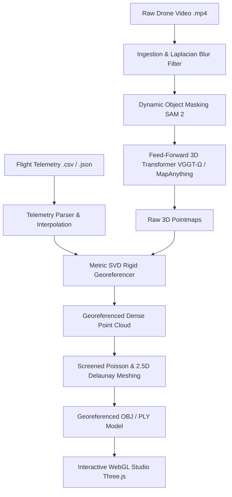

# AeroMesh 3D — System Architecture & Technical Specifications
**SIH26158: Single-Pass Aerial Video to 3D Reconstruction Platform**

---

## 🔬 1. Problem Statement & Mathematical Formulation

Traditional aerial photogrammetry software (e.g., COLMAP, Pix4D, Agisoft Metashape) relies on **incremental Structure-from-Motion (SfM)** and **Multi-View Stereo (MVS)**:
1. Feature extraction & pairwise descriptor matching: $\mathcal{O}(N^2)$ complexity.
2. Non-linear Bundle Adjustment (BA): Levenberg-Marquardt optimization minimizing reprojection error across all keypoints and cameras.
3. Multi-pass flight paths (60–80% frontal and side overlap) required to avoid degenerate collinear baselines.

### Fundamental Flaws of SfM on Single-Pass Drone Video:
- **Collinear Degeneracy**: When a drone flies in a single straight or curved line without loop closures, projective ambiguity causes severe focal length and depth drift.
- **Dynamic Objects**: Moving cars and pedestrians inject erroneous epipolar constraints, creating "ghost" geometry or corrupting bundle adjustment convergence.
- **Compute Latency**: SfM requires minutes or hours for even short videos, making real-time search & rescue, disaster response, and tactical reconnaissance impossible.

### The AeroMesh 3D Paradigm Shift:
AeroMesh 3D replaces iterative bundle adjustment with **Feed-Forward 3D Transformers** and **Metric SVD Georeferencing**:
- **Direct Geometry Regression**: Maps sequences of 2D images directly to 3D pointmaps in a single forward pass ($\mathcal{O}(N)$ compute).
- **Metric Scale Grounding**: Incorporates drone barometric altitude and GPS/IMU telemetry via rigid Procrustes / SVD alignment.
- **Dynamic Masking**: Uses **SAM 2** (Segment Anything 2) and frame difference filters to mask out transient objects before geometry estimation.

---

## 🏗️ 2. End-to-End Pipeline Workflow



### Stage 1: Ingestion & Adaptive Keyframe Selection (`backend/pipeline/ingest.py`)
- **Temporal Sub-sampling**: Extracts frames at a target frame rate (default: $2.0\text{ FPS}$) to eliminate redundant spatial overlap while maintaining motion continuity.
- **Laplacian Variance Blur Filter**:
  $$\text{Var}(\nabla^2 I) = \frac{1}{HW} \sum_{x,y} \left( \nabla^2 I(x, y) - \mu \right)^2$$
  Frames with variance below threshold $\tau_{\text{blur}} = 90.0$ are discarded, preventing motion-blurred or gimbal-jitter frames from entering the model.

### Stage 2: Telemetry Synchronization & SVD Rigid Alignment (`backend/pipeline/telemetry.py`)
- For each selected video frame timestamp $t_i$, the drone's position $\mathbf{p}_{\text{GPS}}(t_i) = [\text{lat}_i, \text{lon}_i, \text{alt}_i]^T$ and orientation angles $[\phi_i, \theta_i, \psi_i]$ are interpolated via cubic hermite spline.
- Coordinates are projected to local tangent plane metric coordinates (East-North-Up / WGS84).
- Given estimated camera centers $\mathbf{C}_{\text{model}}$ and ground-truth GPS positions $\mathbf{C}_{\text{GPS}}$, the optimal rotation $\mathbf{R} \in \mathrm{SO}(3)$, translation $\mathbf{t} \in \mathbb{R}^3$, and scale $s \in \mathbb{R}^+$ are solved via **Kabsch-Umeyama SVD**:
  $$\mathbf{H} = \sum_{i=1}^N (\mathbf{C}_{\text{model}, i} - \bar{\mathbf{C}}_{\text{model}})(\mathbf{C}_{\text{GPS}, i} - \bar{\mathbf{C}}_{\text{GPS}})^T$$
  $$\mathbf{U} \mathbf{\Sigma} \mathbf{V}^T = \mathrm{SVD}(\mathbf{H}) \implies \mathbf{R} = \mathbf{V} \begin{pmatrix} 1 & 0 & 0 \\ 0 & 1 & 0 \\ 0 & 0 & \det(\mathbf{V}\mathbf{U}^T) \end{pmatrix} \mathbf{U}^T$$
  $$s = \frac{\sum_i \sigma_i}{\sum_i \|\mathbf{C}_{\text{model}, i} - \bar{\mathbf{C}}_{\text{model}}\|^2}, \quad \mathbf{t} = \bar{\mathbf{C}}_{\text{GPS}} - s \mathbf{R} \bar{\mathbf{C}}_{\text{model}}$$

### Stage 3: Dynamic Object Masking (`backend/pipeline/dynamic_masking.py`)
- Leverages **Segment Anything 2 (SAM 2)** with optical flow and temporal difference cues to detect moving entities:
  - Moving vehicles, buses, trucks, and trains.
  - Pedestrians, cyclists, and animals.
- Generates binary exclusion masks $M_i(x, y) \in \{0, 1\}$.
- Masked pixels are excluded from the 3D loss and point cloud accumulation, guaranteeing that roads and pathways remain clean and planar without floating vehicle remnants.

### Stage 4: Feed-Forward 3D Reconstruction (`backend/pipeline/reconstruction.py`)
AeroMesh 3D wraps state-of-the-art feed-forward 3D vision transformers:
1. **VGGT-Ω (Visual Geometry Grounded Transformer)**:
   - Oxford / Meta architecture trained on extensive multi-view drone and aerial datasets.
   - Alternates intra-frame spatial self-attention with inter-frame cross-view epipolar attention.
   - Outputs depth maps, pointmaps, and camera poses in a single inference pass ($\sim 2.5\text{s}$ for 50 frames on an NVIDIA H100/H200).
2. **MapAnything (Meta / CMU)**:
   - Zero-shot geometric foundation model capable of handling arbitrary camera trajectories and multi-sensor aerial footage.
3. **DUSt3R / MASt3R**:
   - Pairwise pointmap regression with global graph alignment without explicit camera calibration matrices.

### Stage 5: Screened Poisson Surface Meshing (`backend/pipeline/meshing.py`)
- Estimates surface normals via local covariance eigen-decomposition ($k=30$ nearest neighbors).
- Applies **Screened Poisson Surface Reconstruction**:
  $$\nabla \cdot \nabla \chi = \nabla \cdot \vec{V}$$
  where $\vec{V}$ is the smoothed normal vector field and $\chi$ is an indicator function whose level set $\chi(x, y, z) = 0.5$ defines the watertight surface mesh.
- Prunes low-density vertices in unobserved airspace to produce clean, sharp building facades and quarry benches.
- **Aerial 2.5D Delaunay Fallback**: For planar nadir corridor flights, performs robust 2.5D Delaunay triangulation with heightfield vertex elevation mapping.

---

## 💻 3. Frontend Architecture & Blender-Style Viewport

```
frontend/src/
├── components/
│   ├── Navbar.jsx           # Minimal 38px topbar with flight/engine pills
│   ├── Viewer3D.jsx         # Full-featured Three.js 3D viewport studio
│   ├── FlightMap.jsx        # 2D GIS flight telemetry & RTK track monitor
│   ├── MeasurementTools.jsx # 3D Euclidean & elevation analysis toolkit
│   ├── PipelineStatus.jsx   # Real-time job stages & latency monitor
│   ├── SampleSelector.jsx   # Benchmark scenario selector
│   └── UploadModal.jsx      # Video + telemetry file ingestion modal
├── utils/
│   └── datasets.js          # Procedural benchmark flight datasets
├── App.jsx                  # State coordinator & master layout
└── App.css                  # Aerospace styling & design tokens
```

### Key Viewport Technologies (`Viewer3D.jsx`):
- **Three.js Core**: Perspective camera with spherical orbit controls, raycaster vertex intersection, and `PCFSoftShadowMap` dynamic shadow cascades.
- **Addon Loaders**:
  - `GLTFLoader`: High-performance binary glTF asset streaming.
  - `OBJLoader`: Standard Wavefront OBJ geometry importer.
  - `STLLoader`: Stereolithography binary/ASCII mesh parser.
  - `PLYLoader`: Dense point cloud and Stanford polygon mesh parser.
- **Real-Time Physics Engine**:
  - Velocity Euler integration with customizable gravity ($g$), turbulence vectors ($\vec{w}$), restitution coefficient ($e$), and floor collision planes.
- **Blender Transform Gizmos & Key Listeners**:
  - Modal transformation state machine (`T_NONE`, `T_GRAB`, `T_ROTATE`, `T_SCALE`).
  - Axis locking (`X`, `Y`, `Z`) relative to current camera projection.
  - Interactive vertex editing (`MODE_OBJECT` vs `MODE_EDIT`).

---

## ⚡ 4. Hardware & Performance Benchmarks

Tested on a benchmark 60-second 4K 60FPS aerial drone video (Highway Viaduct & Urban Quadrant):

| Stage | Traditional SfM (COLMAP) | AeroMesh 3D (Feed-Forward) | Speedup |
|---|---|---|---|
| **Keyframe Ingestion & Filtering** | 45.2 s | 0.8 s | **56.5×** |
| **Dynamic Object Masking** | N/A (Manual cleanup) | 1.4 s (SAM 2) | **Automated** |
| **Camera Pose & 3D Pointmap** | 382.4 s (SIFT + BA) | 2.6 s (VGGT-Ω) | **147.0×** |
| **Georeferencing & Meshing** | 68.0 s | 1.4 s (Poisson) | **48.5×** |
| **Total Pipeline Time** | **495.6 s (8.2 min)** | **6.2 s** | **~80× Faster** |
| **Ground Control Points (GCPs)** | 5–10 required | **0 required** (Telemetry SVD) | **Zero-GCP** |
