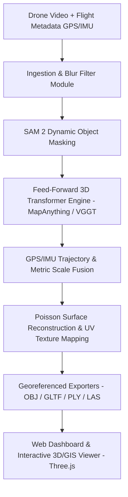

# Product Requirements Document (PRD) & Implementation Plan: SIH26158 — Single-Pass Drone Video to 3D Model Platform

## Overview
**SIH26158** addresses the critical challenge of converting single-pass drone footage and flight metadata into georeferenced, metrically accurate 3D point clouds and textured meshes in near real-time without requiring multi-pass reprocessing or dense Ground Control Points (GCPs).

This project delivers a **full-stack end-to-end platform**:
1. **Core AI/Geometry Engine (Python)**: Feed-forward 3D reconstruction pipeline (leveraging MapAnything/VGGT/DUSt3R concepts, SAM2 dynamic object masking, GPS/IMU trajectory alignment, and Poisson surface reconstruction).
2. **Modern Web GIS & 3D Interactive Web Application**: High-performance dashboard featuring single-pass video upload, telemetry parsing, interactive 3D mesh/point cloud rendering (Three.js/WebGL), georeferenced trajectory visualization, dynamic masking controls, and real-time metric measurement tools (distance, elevation, surface area).

---

## User Review Required

> [!IMPORTANT]
> **Key Architecture Decisions & Hardware Context:**
> 1. **Compute & Fallbacks**: Deep feed-forward transformers (MapAnything / VGGT-Ω) require high-end GPU compute (e.g., NVIDIA H200/A100). We will implement a Python processing pipeline with modular transformer backends + a complete client-side WebGL demo sandbox pre-loaded with sample drone flight datasets so the platform works seamlessly both live with GPU backend and standalone during hackathon demonstrations.
> 2. **Metric Scale & Accuracy Positioning**: Single-pass reconstruction without dense GCPs achieves meter-level metric accuracy anchored by flight altitude, camera intrinsics, and GPS track fusion.
> 3. **Occlusion & Coverage**: Surfaces fully occluded from single-pass flight vectors are flagged with spatial confidence scores.

---

## System Architecture



---

## Open Questions

> [!NOTE]
> 1. Do you have target drone telemetry formats preferred for testing (e.g., DJI SRT logs, CSV flight logs, standard EXIF GPS, or custom JSON)? *(Default: We will support standard CSV/JSON telemetry logs and embedded EXIF/SRT metadata).*
> 2. Would you like a backend API server (FastAPI/Python) included for live backend integration, alongside the rich Web application frontend? *(Default: Yes, we will provide both the Python core engine scripts/API and the web frontend).*

---

## Key Features & Requirements

### 1. Ingestion & Pre-processing
- Adaptive frame extraction with laplacian variance blur detection to skip unusable frames.
- Telemetry log reader (parsing timestamps, latitude, longitude, altitude, yaw, pitch, roll, focal length).

### 2. Dynamic Object Removal
- SAM 2 / Segmentation masking for moving objects (vehicles, pedestrians) to prevent geometry artifacts.

### 3. Feed-Forward 3D Reconstruction Engine
- Direct frame-to-point-cloud transformer pipeline.
- Camera trajectory estimation and global point map generation.
- Rigid transformation to align camera trajectory with GPS flight path for georeferencing and scale anchoring.

### 4. Surface Reconstruction & Mesh Texturing
- Open3D Poisson surface reconstruction & mesh smoothing.
- Source video frame texture projection onto generated mesh UV maps.
- Export to standard formats: `.obj`, `.gltf`/`.glb`, `.ply`, `.las`.

### 5. Web GIS & 3D Interactive Platform
- **UI/UX Aesthetics**: Modern dark glassmorphism theme, vibrant accent palette, intuitive flight telemetry cards, live processing timeline.
- **Dual View Canvas**:
  - 3D WebGL Canvas (Three.js): Interactive rotation, zooming, lighting control, texture toggle, point cloud vs mesh rendering.
  - Flight Trajectory Map: Synchronized camera pose vectors and flight path overlay.
- **Metric Measurement Toolkit**: Point-to-point 3D distance tool, elevation profile query, surface area calculator.
- **Dataset Inspector & Demo Suite**: Pre-loaded high-resolution 3D models from sample drone flights for zero-wait judge evaluation.

---

## Proposed Changes & File Structure

We will create a structured codebase under `c:\Users\mdawa\OneDrive\Desktop\New SIH`:

```
c:\Users\mdawa\OneDrive\Desktop\New SIH\
├── Sih new.md                          # Original research notes
├── README.md                           # Comprehensive documentation & setup guide
├── backend/                            # Python Core Processing Engine
│   ├── requirements.txt                # Dependencies (PyTorch, Open3D, OpenCV, NumPy, FastAPI)
│   ├── app.py                          # FastAPI server for pipeline job handling
│   ├── pipeline/
│   │   ├── ingest.py                   # Frame extraction & blur detection
│   │   ├── telemetry.py                # Telemetry parser & GPS trajectory alignment
│   │   ├── dynamic_masking.py          # SAM 2 / motion masking wrapper
│   │   ├── reconstruction.py           # Feed-forward 3D transformer wrapper (MapAnything/VGGT)
│   │   └── meshing.py                  # Poisson surface reconstruction & texture mapping
│   └── scripts/
│       └── process_flight.py           # CLI processing script
├── frontend/                           # Interactive Web Platform
│   ├── package.json
│   ├── vite.config.js
│   ├── index.html
│   ├── src/
│   │   ├── main.jsx
│   │   ├── App.jsx
│   │   ├── App.css                     # Premium Glassmorphism & Modern Styling
│   │   ├── components/
│   │   │   ├── Navbar.jsx              # Navigation & System Status Header
│   │   │   ├── UploadModal.jsx         # Video & Telemetry Drag-and-Drop Ingest
│   │   │   ├── Viewer3D.jsx            # Three.js 3D Mesh / Point Cloud Viewer
│   │   │   ├── FlightMap.jsx           # Trajectory & Telemetry Interactive Map
│   │   │   ├── MeasurementTools.jsx    # Metric Distance & Elevation Tooling
│   │   │   ├── PipelineStatus.jsx      # Live processing step logs & telemetry feeds
│   │   │   └── SampleSelector.jsx      # Pre-loaded Drone Flight Datasets Switcher
│   │   └── assets/
│   │       └── sample_data/            # Sample point clouds, meshes & telemetry
```

---

## Implementation Phases

### Phase 1: Core Architecture & Ingestion Setup
- Define directory structure and Python requirements.
- Build Python ingestion and telemetry parsing modules.

### Phase 2: Web Platform & Interactive 3D Viewer
- Initialize Vite + React web app with styling system.
- Build Three.js 3D Mesh & Point Cloud canvas with metric measurement tools, orbit controls, texture toggles, and lighting settings.
- Build Telemetry & Trajectory map visualization component.

### Phase 3: Python 3D Reconstruction Pipeline
- Implement PyTorch/Open3D pipeline for 3D point cloud generation, scale fusion, Poisson meshing, and GLTF export.
- Set up FastAPI integration endpoints connecting the backend engine to the frontend web app.

### Phase 4: Sample Datasets & Demo Optimization
- Generate sample 3D datasets (textured drone models, point clouds, trajectory GPS logs) for realistic demo scenarios.
- Verify end-to-end functionality, performance, and responsive UI layout.

---

## Verification Plan

### Automated Verification
- Python CLI test script `python backend/scripts/process_flight.py` verifying frame extraction, telemetry alignment, and mesh output.
- Frontend build validation: `npm run build` inside `frontend/`.

### Manual Verification
- Launch web application via `npm run dev` and test interactive 3D model rotation, point cloud toggle, metric measurements, and flight log ingestion.
- Test switching between sample drone flight datasets (e.g., Rural Terrain, Urban Structure, Bridge Infrastructure).
